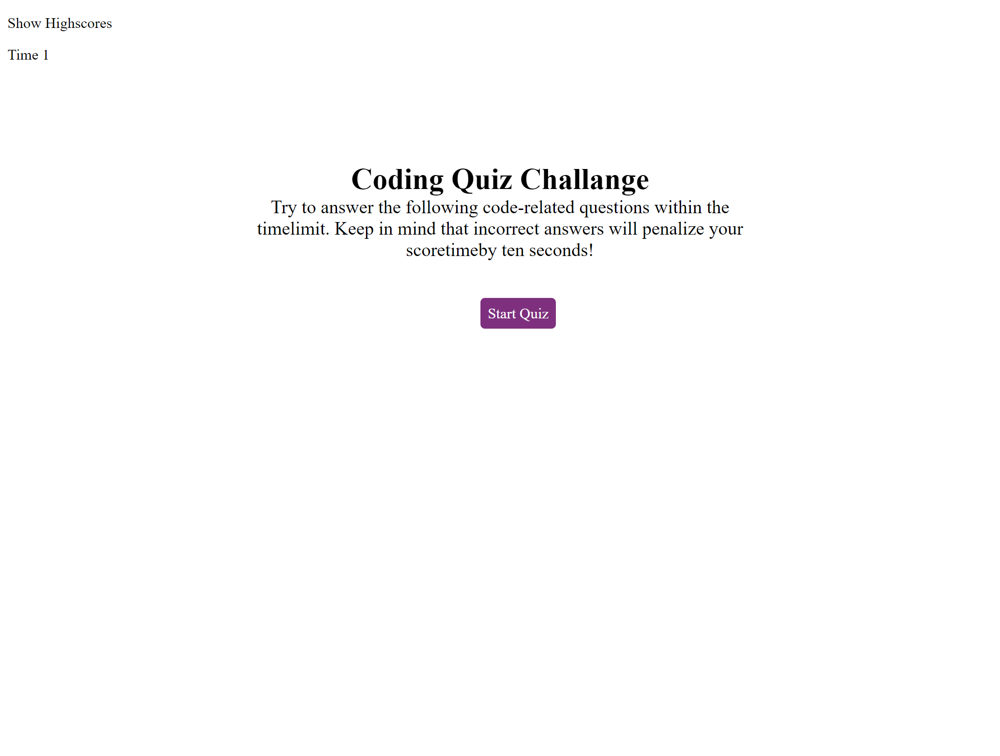
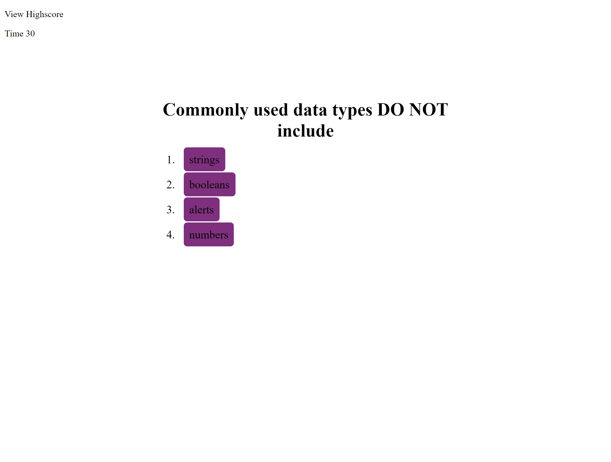
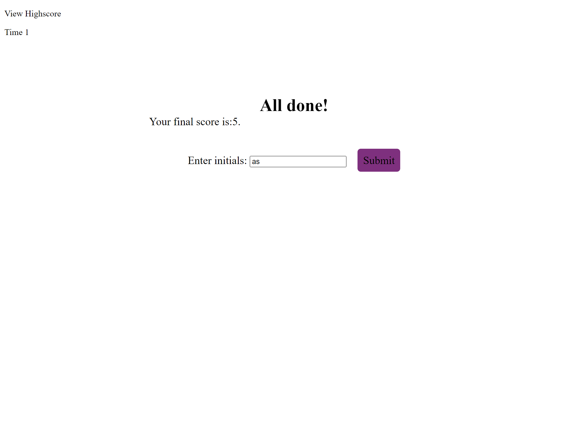
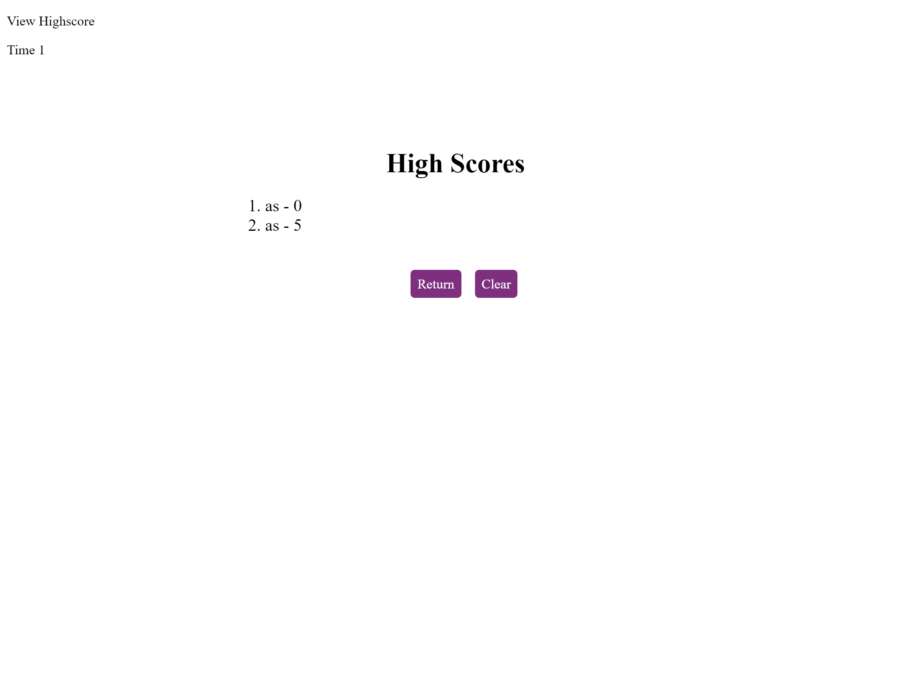
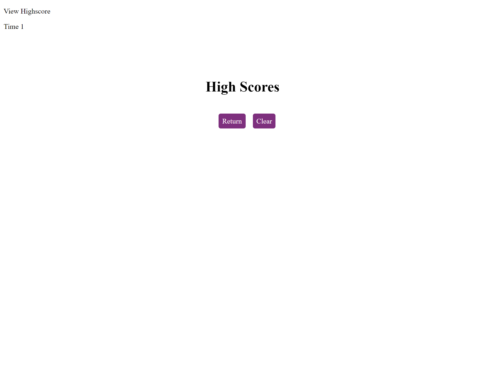

# 04 Web APIs: Code Quiz

## User Story

```
AS A coding boot camp student
I WANT to take a timed quiz on JavaScript fundamentals that stores high scores
SO THAT I can gauge my progress compared to my peers
```

## Acceptance Criteria

```
GIVEN I am taking a code quiz
WHEN I click the start button
THEN a timer starts and I am presented with a question
WHEN I answer a question
THEN I am presented with another question
WHEN I answer a question incorrectly
THEN time is subtracted from the clock
WHEN all questions are answered or the timer reaches 0
THEN the game is over
WHEN the game is over
THEN I can save my initials and my score
```

## Screenshot

The following image shows the web application's appearance and functionality:


> **Note**: Start

> **Note**: Question

> **Note**: Add initials

> **Note**: Showing scores

> **Note**: Cleared scores

> **Note**: Cleared scores

## Link to web page
[Code Quiz](https://eamahma.github.io/Code-Quiz/)

## Link to Github repository
[Github page for Code Quiz](https://github.com/eamahma/Code-Quiz)

## Link to video of application in action
[Video of application inaction](https://drive.google.com/file/d/1PdRI-rGsowe_xY0dbQZmkDMQfKm3bOzn/view)

## Description
* Mainly used javascript and jQuery to develop the application
* Dynamically created elements and controlled DOM objects by JavaScript
* Several bugs fixed.
* Code refactored - still room to improvements
* comments added
* readme file updated